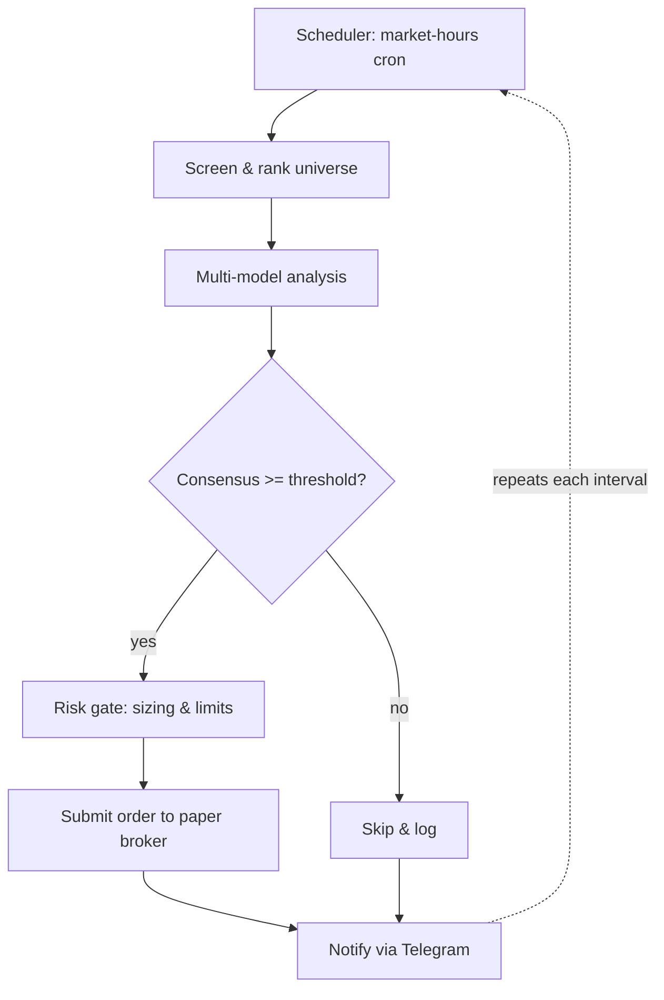

# Equity Autopilot

A reference design for an unattended, consensus-gated equity trader that runs on a
**paper** brokerage account. Nothing here touches real money by default, and it must not
without an explicit, deliberate configuration change by the operator.

> Not financial advice. This is an engineering pattern for a simulated trading system.
> Markets are adversarial and most automated strategies lose money. Treat live deployment
> as out of scope until you have independently validated the strategy yourself.

## When to use

Activate when the user wants to:

- Set up or run autonomous / scheduled stock trading.
- Build a background worker that screens, decides, and trades on its own.
- Add consensus-based decisioning (multiple models voting) to a trading flow.
- Wire trade alerts and remote controls into Telegram.

## Dependencies

Install with `pip install -r requirements.txt`. Summary:

| Package | Role |
|---|---|
| `yfinance` + `pandas` | Price/volume history and news flags for screening |
| `pandas-market-calendars` | Skip holidays and early closes |
| `alpaca-py` | Paper-account orders, positions, equity |
| `APScheduler` + `pytz` | Drive the daily loop in US/Eastern |
| `python-telegram-bot` (v21+) | Notifications and `/status`, `/stop`, `/resume` |
| `python-dotenv` (optional) | Load secrets in dev |

Standard-library modules (`asyncio`, `uuid`, `sqlite3`, `dataclasses`, `collections`,
`datetime`, `os`) need no installation. External prerequisites: an Alpaca paper API
key/secret, a Telegram bot token + chat ID, and a host that can run a long-lived worker.

## How the loop works



At each scheduled point the system narrows a broad universe to a short list, gathers
independent opinions, acts only on agreement, double-checks risk, places the order, and
reports back. Every decision — including the ones it declines — is journaled so the run is
auditable after the fact.

## Configuration

Keep all tunables in one place. Conviction-scaled sizing and the consensus threshold are
the two knobs that most change behaviour, so make them explicit.

```python
# autopilot/config.py
from dataclasses import dataclass, field

# Default universe: liquid large/mid-cap software & growth names.
# Swap freely — the scanner treats this purely as input.
DEFAULT_UNIVERSE = [
    "CRM", "ORCL", "ADBE", "QCOM", "TXN", "INTU", "NOW", "PANW",
    "SNOW", "DDOG", "SHOP", "UBER", "ABNB", "MELI", "PYPL", "WDAY",
]

@dataclass
class ScanRule:
    min_avg_volume: int = 750_000     # liquidity floor (shares/day)
    min_abs_move_pct: float = 1.5     # ignore the inert
    lookback_sessions: int = 7
    shortlist_size: int = 8

@dataclass
class RiskLimits:
    max_trades_per_day: int = 12
    max_position_pct: float = 12.0    # of equity, per name
    max_daily_loss_pct: float = 4.0   # halt for the day past this
    min_cash_pct: float = 25.0        # never deploy below this reserve
    max_price: float = 1500.0         # skip ultra-high-priced names
    min_volume: int = 750_000

@dataclass
class Settings:
    agree_threshold: float = 0.70     # fraction of analysts that must align
    dry_run: bool = True              # log orders, do not submit
    scan: ScanRule = field(default_factory=ScanRule)
    risk: RiskLimits = field(default_factory=RiskLimits)
```

Secrets come from the environment, never the codebase:

```
ALPACA_API_KEY=...
ALPACA_SECRET_KEY=...
TELEGRAM_BOT_TOKEN=...
TELEGRAM_CHAT_ID=...
AUTOPILOT_DRY_RUN=true        # belt-and-suspenders override
```

## Components

### 1. Candidate scanner

Sweep the universe, drop anything illiquid or flat, score what's left. One bad symbol must
never abort the whole scan.

```python
# autopilot/scanner.py
import yfinance as yf
from .config import DEFAULT_UNIVERSE, ScanRule

class CandidateScanner:
    def __init__(self, universe=None, rules: ScanRule | None = None):
        self.universe = universe or DEFAULT_UNIVERSE
        self.rules = rules or ScanRule()

    def _score(self, move_pct, avg_vol, has_news):
        liquidity = min(avg_vol / 5_000_000, 1.0)
        catalyst = 1.0 if has_news else 0.0
        return abs(move_pct) * 0.5 + liquidity * 30 * 0.3 + catalyst * 20 * 0.2

    def scan(self) -> list[dict]:
        picks = []
        for symbol in self.universe:
            try:
                t = yf.Ticker(symbol)
                bars = t.history(period=f"{self.rules.lookback_sessions}d")
                if len(bars) < 2:
                    continue
                last, prior = bars["Close"].iloc[-1], bars["Close"].iloc[-2]
                move_pct = (last - prior) / prior * 100
                avg_vol = bars["Volume"].mean()
                if avg_vol < self.rules.min_avg_volume:
                    continue
                if abs(move_pct) < self.rules.min_abs_move_pct:
                    continue
                has_news = bool(getattr(t, "news", []))
                picks.append({
                    "symbol": symbol,
                    "last": round(float(last), 2),
                    "move_pct": round(float(move_pct), 2),
                    "avg_vol": int(avg_vol),
                    "score": round(self._score(move_pct, avg_vol, has_news), 2),
                })
            except Exception as err:
                print(f"scan skipped {symbol}: {err}")
        picks.sort(key=lambda r: r["score"], reverse=True)
        return picks[: self.rules.shortlist_size]
```

### 2. Ensemble decider

Each analyst is just a callable returning `{"call", "confidence", "reason"}`. The decider
tallies the votes and reports whether agreement cleared the threshold — it does not act.

```python
# autopilot/decision.py
import asyncio
from collections import Counter

class EnsembleDecider:
    def __init__(self, analysts, agree_threshold: float = 0.70):
        self.analysts = analysts            # callables: symbol -> ballot dict
        self.agree_threshold = agree_threshold

    async def evaluate(self, symbol: str) -> dict:
        ballots = await asyncio.gather(*(a(symbol) for a in self.analysts))
        calls = [b["call"] for b in ballots]            # BUY / SELL / HOLD
        winner, votes = Counter(calls).most_common(1)[0]
        agreement = votes / len(calls)
        avg_conf = sum(b["confidence"] for b in ballots) / len(ballots)
        return {
            "symbol": symbol,
            "verdict": winner,
            "agreement": agreement,
            "confidence": avg_conf,
            "passed": agreement >= self.agree_threshold and winner in {"BUY", "SELL"},
            "ballots": ballots,
        }
```

### 3. Risk governor

Conviction scales exposure; hard limits cap it. Sizing also respects the cash reserve.

```python
# autopilot/risk.py
from .config import RiskLimits

class RiskGovernor:
    def __init__(self, broker, limits: RiskLimits):
        self.broker = broker
        self.limits = limits

    def size_position(self, price: float, agreement: float) -> int:
        acct = self.broker.account()
        equity, cash = float(acct.portfolio_value), float(acct.cash)
        # 2% floor, +1% for every 10 agreement-points above threshold
        base = 0.02 + max(agreement - 0.70, 0) * 0.10
        budget = equity * min(base, self.limits.max_position_pct / 100)
        spendable = max(cash - equity * self.limits.min_cash_pct / 100, 0)
        return int(min(budget, spendable) // price)

    def is_allowed(self, ctx: dict) -> bool:
        l = self.limits
        return all([
            ctx["trades_today"] < l.max_trades_per_day,
            ctx["daily_pl_pct"] > -l.max_daily_loss_pct,
            ctx["price"] <= l.max_price,
            ctx["avg_vol"] >= l.min_volume,
        ])
```

### 4. Broker gateway

Wrap the SDK so the rest of the system is broker-agnostic. A stable `client_order_id`
makes retries idempotent — re-sending after a timeout won't double the position.

```python
# autopilot/broker.py
import uuid
from alpaca.trading.client import TradingClient
from alpaca.trading.requests import MarketOrderRequest
from alpaca.trading.enums import OrderSide, TimeInForce

class BrokerGateway:
    def __init__(self, key, secret, paper: bool = True):
        self.client = TradingClient(key, secret, paper=paper)

    def account(self):
        return self.client.get_account()

    def positions(self):
        return self.client.get_all_positions()

    def place(self, symbol: str, qty: int, side: str):
        req = MarketOrderRequest(
            symbol=symbol,
            qty=qty,
            side=OrderSide.BUY if side == "BUY" else OrderSide.SELL,
            time_in_force=TimeInForce.DAY,
            client_order_id=f"ap-{symbol}-{uuid.uuid4().hex[:8]}",
        )
        return self.client.submit_order(req)
```

### 5. Scheduler

Fire jobs on trading days only. The calendar check is what keeps the bot quiet on holidays.

```python
# autopilot/scheduler.py
import datetime as dt
import pytz
import pandas_market_calendars as mcal
from apscheduler.schedulers.asyncio import AsyncIOScheduler

ET = pytz.timezone("US/Eastern")
NYSE = mcal.get_calendar("NYSE")

def is_trading_day(day: dt.date | None = None) -> bool:
    day = day or dt.datetime.now(ET).date()
    return not NYSE.schedule(start_date=day, end_date=day).empty

class TradingScheduler:
    def __init__(self, pipeline):
        self.pipeline = pipeline
        self.sched = AsyncIOScheduler(timezone=ET)

    async def _guarded(self, job):
        if is_trading_day():
            await job()

    def install(self):
        wd = dict(day_of_week="mon-fri")
        plan = [
            (self.pipeline.premarket,  9,  0),
            (self.pipeline.open_bell,  9,  35),
            (self.pipeline.midday,     12, 30),
            (self.pipeline.close_bell, 16, 5),
        ]
        for job, hour, minute in plan:
            self.sched.add_job(self._guarded, "cron", hour=hour, minute=minute,
                               args=[job], **wd)
        self.sched.start()
```

### 6. Notifier

Thin Telegram wrapper. Notification failures should warn, never crash the run.

```python
# autopilot/notify.py
import os
from telegram import Bot
from telegram.constants import ParseMode

class Notifier:
    def __init__(self):
        self.bot = Bot(os.environ["TELEGRAM_BOT_TOKEN"])
        self.chat = os.environ["TELEGRAM_CHAT_ID"]

    async def push(self, text: str):
        try:
            await self.bot.send_message(self.chat, text, parse_mode=ParseMode.MARKDOWN)
        except Exception as err:
            print(f"notify failed: {err}")
```

### 7. Trade journal

Persist every executed trade with the ballots that justified it — the audit trail.

```python
# autopilot/journal.py
import json, sqlite3, datetime as dt

SCHEMA = """
CREATE TABLE IF NOT EXISTS trades (
  id         INTEGER PRIMARY KEY,
  ts         TEXT NOT NULL,
  symbol     TEXT NOT NULL,
  side       TEXT NOT NULL,
  qty        INTEGER NOT NULL,
  price      REAL NOT NULL,
  agreement  REAL,
  confidence REAL,
  order_id   TEXT,
  ballots    TEXT
);
"""

class TradeJournal:
    def __init__(self, path: str = "autopilot.db"):
        self.cx = sqlite3.connect(path)
        self.cx.executescript(SCHEMA)

    def record(self, decision: dict, qty: int, price: float, order_id: str):
        self.cx.execute(
            "INSERT INTO trades(ts,symbol,side,qty,price,agreement,confidence,order_id,ballots)"
            " VALUES(?,?,?,?,?,?,?,?,?)",
            (dt.datetime.utcnow().isoformat(), decision["symbol"], decision["verdict"],
             qty, price, decision["agreement"], decision["confidence"], order_id,
             json.dumps(decision["ballots"])),
        )
        self.cx.commit()
```

### 8. Pipeline glue

Ties the parts together and owns the four daily entry points.

```python
# autopilot/pipeline.py
class Pipeline:
    def __init__(self, scanner, decider, risk, broker, notifier, journal, settings):
        self.scanner, self.decider, self.risk = scanner, decider, risk
        self.broker, self.notifier, self.journal = broker, notifier, journal
        self.settings = settings
        self.watchlist, self.trades_today = [], 0

    async def premarket(self):
        self.trades_today = 0
        self.watchlist = self.scanner.scan()
        lines = "\n".join(
            f"• *{p['symbol']}* ({p['move_pct']:+.2f}%)  score {p['score']}"
            for p in self.watchlist
        )
        await self.notifier.push(f"🌅 *Today's watchlist*\n{lines or '_nothing qualified_'}")

    async def open_bell(self):
        await self.notifier.push(f"🔔 Analyzing {len(self.watchlist)} names...")
        for pick in self.watchlist:
            await self._consider(pick)

    async def _consider(self, pick: dict):
        d = await self.decider.evaluate(pick["symbol"])
        if not d["passed"]:
            await self.notifier.push(
                f"⏭️ Skipping *{d['symbol']}* — only {d['agreement']:.0%} agree"
            )
            return
        ctx = {"trades_today": self.trades_today, "daily_pl_pct": self._daily_pl_pct(),
               "price": pick["last"], "avg_vol": pick["avg_vol"]}
        if not self.risk.is_allowed(ctx):
            await self.notifier.push(f"🚧 Risk gate blocked *{d['symbol']}*")
            return
        qty = self.risk.size_position(pick["last"], d["agreement"])
        if qty < 1:
            return
        if self.settings.dry_run:
            await self.notifier.push(
                f"🧪 [dry run] {d['verdict']} {qty} {d['symbol']} @ ~${pick['last']:.2f}"
            )
            return
        order = self.broker.place(d["symbol"], qty, d["verdict"])
        self.trades_today += 1
        self.journal.record(d, qty, pick["last"], order.id)
        await self.notifier.push(
            f"✅ *{d['verdict']} {d['symbol']}*\n{qty} @ ${pick['last']:.2f} "
            f"• agree {d['agreement']:.0%} • order {order.id}"
        )

    def _daily_pl_pct(self) -> float:
        a = self.broker.account()
        base = float(a.last_equity) or 1.0
        return (float(a.equity) - float(a.last_equity)) / base * 100
```

## Safety rails

- **Dry run by default.** `Settings.dry_run = True` (and the `AUTOPILOT_DRY_RUN` env var)
  log intended orders without submitting. Flip it off only after a clean dry run.
- **Hard limits always enforced.** Trade count, position size, daily-loss halt, cash
  reserve, and price/volume floors live in `RiskLimits` and are checked before every order.
- **Kill switch.** A shared flag (e.g. `TRADING_ENABLED`) gates `_consider`; a Telegram
  `/stop` command sets it false instantly. Open positions are left untouched — the switch
  stops *new* activity only.
- **Idempotent orders.** The `client_order_id` means a retry after a network blip won't
  duplicate a fill.

## Deployment (24/7 worker)

```
# Procfile
worker: python -m autopilot.main
```

```dockerfile
# Dockerfile
FROM python:3.11-slim
WORKDIR /app
COPY requirements.txt .
RUN pip install --no-cache-dir -r requirements.txt
COPY autopilot/ ./autopilot/
CMD ["python", "-m", "autopilot.main"]
```

`autopilot/main.py` wires the components, sends a startup ping, calls
`TradingScheduler(...).install()`, and idles with `asyncio.sleep` so the scheduler keeps
running.

## Monitoring commands

```
/status     current equity and open positions
/today      trades executed today
/watchlist  this session's shortlist
/limits     active risk limits
/stop       halt new trading immediately
/resume     re-enable trading
```

## Backtest gating (recommended)

Don't let a symbol or rule go live (even on paper) until it has cleared an out-of-sample
backtest. Chain the `backtest-expert` skill to stress-test parameters, model slippage, and
check robustness before adding anything to `DEFAULT_UNIVERSE` or loosening
`agree_threshold`. The `theme-detector` skill is a useful optional input for choosing which
universe to scan in the first place.

## Rollout plan

1. **Dry run, one week.** `dry_run=True`, full universe, watch the Telegram stream. Confirm
   the scanner, decider, and risk gate behave before any order is placed.
2. **Tiny live-paper.** Two names per day, `agree_threshold=0.80`, ~2% positions.
3. **Widen gradually.** Loosen one knob at a time and compare journaled results against the
   prior week. Keep the cash reserve and daily-loss halt fixed.

## Expected notifications

```
🌅 Today's watchlist
• SNOW (+3.10%)  score 41.2
• DDOG (-2.40%)  score 38.9

🔔 Analyzing 6 names...
✅ BUY SNOW
8 @ $172.40 • agree 83% • order ap-SNOW-9c1f4a02
⏭️ Skipping DDOG — only 50% agree

🏁 Close summary
Equity: $10,412.00 • Daily P&L: +$312.00 (+3.09%)
Open: SNOW +$96.00 · CRM -$18.00
```
